# 📋 Product Backlog — AcolheAI

### 🎓 TCC · Pós-Graduação · Metodologia SCRUM

**📅 Período:** Fevereiro – Julho 2027 | **📦 Total de User Stories:** 15 | **🔄 Sprints:** 3

---

## 🎯 Visão Geral do Projeto

> **Projeto:** AcolheAI — Plataforma de Hospedagem Solidária e Pontos de Apoio com Agente de IA

**Objetivo Geral:** Desenvolver uma plataforma web inteligente que conecta pessoas em situação de vulnerabilidade (doentes, cuidadores e familiares) a lares solidários e pontos de apoio, utilizando um agente conversacional com IA e motor de matching geográfico para recomendar opções próximas com base no perfil e necessidade do usuário.

### 🏁 MVP Esperado

```
┌──────────────────────────────────────────────────────────────────────────────┐
│                          MVP DO ACOLHEAI                                     │
├────────────────────┬───────────────────┬───────────────────┬─────────────────┤
│  🏠 Cadastro de    │  🤖 Agente        │  📍 Matching      │  🔒 Autent.     │
│  Lares e Pontos   │  Conversacional   │  Geográfico       │  e Perfis       │
│  de Apoio         │  (LangChain/OAI)  │  (Haversine)      │  de Usuário     │
├────────────────────┴───────────────────┴───────────────────┴─────────────────┤
│  🌐 Interface web responsiva (Next.js)  │  ⚙️ API REST (NestJS + PostgreSQL) │
│  🐳 Infra Docker + Nginx               │  🧠 AI Service (FastAPI + Python)  │
└──────────────────────────────────────────────────────────────────────────────┘
```

---

## 🏗️ Justificativa da Escolha do Método Ágil — SCRUM

O **SCRUM** foi escolhido como metodologia por ser o framework ágil mais adequado para um projeto de TCC individual com prazo semestral definido. Suas características se alinham diretamente com o contexto do AcolheAI:

- **Sprints bem delimitadas** permitem organizar o semestre em ciclos de entrega incremental, tornando o progresso visível e mensurável ao orientador.
- **Product Backlog priorizado** garante que as funcionalidades de maior valor (matching, agente de IA e cadastro de lares) sejam desenvolvidas primeiro, protegendo o MVP mesmo em caso de imprevistos.
- **Cerimônias adaptadas** (Sprint Review e Retrospectiva) servem como pontos formais de autoavaliação e alinhamento com o orientador, substituindo a dinâmica de time por revisões individuais documentadas.
- **Critérios de "pronto" (Definition of Done)** claros para cada User Story evitam entregas incompletas e garantem qualidade acumulativa ao longo do semestre.
- **Transparência e rastreabilidade** via GitHub Issues e GitHub Projects viabilizam o acompanhamento do avanço do TCC de forma auditável.

---

## 🗺️ Visão Geral da Arquitetura do Sistema

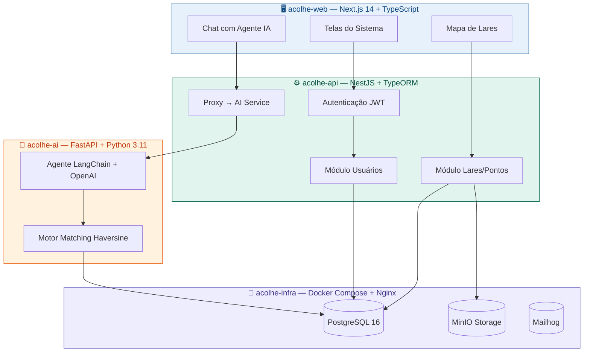

---

## 📅 Estrutura das Sprints e Cronograma

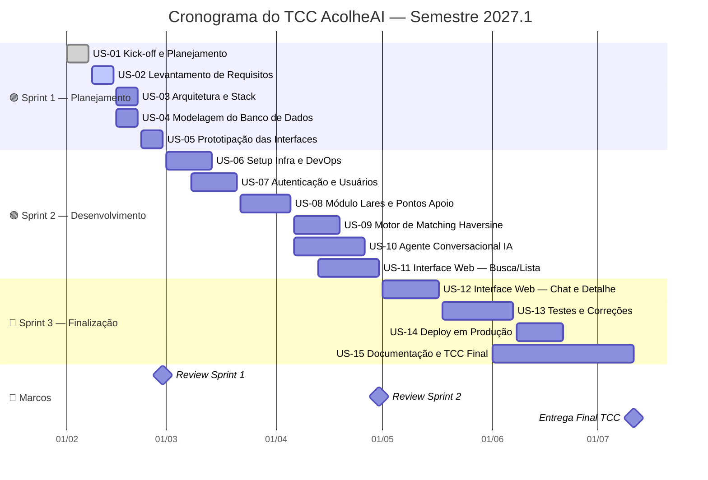

| 🔄 Sprint                   | 📅 Período          | 📦 User Stories  | 🏆 Entrega                        |
| -------------------------- | ------------------ | --------------- | --------------------------------- |
| Sprint 1 — Planejamento    | 01/02 → 28/02/2027 | US-01 a US-05   | Protótipo validado + BD modelado  |
| Sprint 2 — Desenvolvimento | 01/03 → 30/04/2027 | US-06 a US-11   | MVP funcional (matching + agente) |
| Sprint 3 — Finalização     | 01/05 → 11/07/2027 | US-12 a US-15   | Entrega final do TCC              |

### 📌 Marcos (Milestones) do Projeto

```
28/02/2027                  30/04/2027                11/07/2027
    │                           │                          │
    ▼                           ▼                          ▼
┌──────────────┐          ┌──────────────┐          ┌──────────────┐
│  REVIEW      │          │  REVIEW      │          │  ENTREGA     │
│  SPRINT 1    │          │  SPRINT 2    │          │  FINAL TCC   │
│  Protótipo   │          │  MVP pronto  │          │  Deploy +    │
│  aprovado    │          │  e rodando   │          │  Defesa      │
└──────────────┘          └──────────────┘          └──────────────┘
```

---

## 🗂️ Mapa de Dependências entre User Stories

```mermaid
graph LR
    US01["🤝 US-01\nKick-off"]
    US02["📄 US-02\nRequisitos"]
    US03["🏗️ US-03\nArquitetura"]
    US04["🗄️ US-04\nBanco de Dados"]
    US05["🎨 US-05\nProtótipo"]
    US06["🐳 US-06\nInfra/DevOps"]
    US07["🔒 US-07\nAutenticação"]
    US08["🏠 US-08\nLares e Pontos"]
    US09["📍 US-09\nMatching"]
    US10["🤖 US-10\nAgente IA"]
    US11["🌐 US-11\nUI Busca"]
    US12["💬 US-12\nUI Chat"]
    US13["🧪 US-13\nTestes"]
    US14["🚀 US-14\nDeploy"]
    US15["📚 US-15\nDocumentação"]

    US01 --> US02
    US02 --> US03
    US02 --> US04
    US02 --> US05
    US03 --> US04
    US03 --> US06
    US04 --> US07
    US04 --> US08
    US06 --> US07
    US06 --> US08
    US07 --> US08
    US08 --> US09
    US08 --> US10
    US09 --> US10
    US07 --> US11
    US08 --> US11
    US09 --> US11
    US10 --> US12
    US11 --> US12
    US11 --> US13
    US12 --> US13
    US13 --> US14
    US13 --> US15
    US14 --> US15

    style US01 fill:#EEEDFE,stroke:#534AB7,color:#3C3489
    style US02 fill:#EEEDFE,stroke:#534AB7,color:#3C3489
    style US03 fill:#EEEDFE,stroke:#534AB7,color:#3C3489
    style US04 fill:#EEEDFE,stroke:#534AB7,color:#3C3489
    style US05 fill:#EEEDFE,stroke:#534AB7,color:#3C3489
    style US06 fill:#E1F5EE,stroke:#0F6E56,color:#085041
    style US07 fill:#E1F5EE,stroke:#0F6E56,color:#085041
    style US08 fill:#E1F5EE,stroke:#0F6E56,color:#085041
    style US09 fill:#FFF3E0,stroke:#E65100,color:#BF360C
    style US10 fill:#FFF3E0,stroke:#E65100,color:#BF360C
    style US11 fill:#E1F5EE,stroke:#0F6E56,color:#085041
    style US12 fill:#E6F1FB,stroke:#185FA5,color:#0C447C
    style US13 fill:#E6F1FB,stroke:#185FA5,color:#0C447C
    style US14 fill:#E6F1FB,stroke:#185FA5,color:#0C447C
    style US15 fill:#E6F1FB,stroke:#185FA5,color:#0C447C
```

---

## 📊 Resumo do Backlog

### Distribuição por Prioridade e Esforço (Story Points)

```
PRIORIDADE ALTA  ██████████████████████████████████  9 USs  (79 SP)
PRIORIDADE MÉDIA ████████████████░░░░░░░░░░░░░░░░░░  4 USs  (28 SP)
PRIORIDADE BAIXA ████████░░░░░░░░░░░░░░░░░░░░░░░░░░  2 USs  (16 SP)
                                                    ──────────────
TOTAL                                               15 USs  (123 SP)

ESFORÇO POR SPRINT
Sprint 1  ████████████░░░░░░░░░░░░░░░░░░░░  29 SP  (24%)
Sprint 2  █████████████████████████░░░░░░░  60 SP  (49%)
Sprint 3  ████████████████░░░░░░░░░░░░░░░░  34 SP  (27%)
```

| 🆔 ID  | 📌 Título                                                   | 🔴 Prioridade | 🔄 Sprint | 📊 Story Points | 🚦 Status  | 📅 Prazo    |
| ----- | ----------------------------------------------------------- | ------------ | -------- | -------------- | --------- | ---------- |
| US-01 | 🤝 Kick-off e Planejamento do TCC                           | 🔴 Alta       | Sprint 1 | 3 SP           | ⬜ A Fazer | 07/02/2027 |
| US-02 | 📄 Levantamento e Documentação de Requisitos                | 🔴 Alta       | Sprint 1 | 5 SP           | ⬜ A Fazer | 14/02/2027 |
| US-03 | 🏗️ Definição de Arquitetura e Stack Tecnológico            | 🔴 Alta       | Sprint 1 | 5 SP           | ⬜ A Fazer | 21/02/2027 |
| US-04 | 🗄️ Modelagem do Banco de Dados                             | 🔴 Alta       | Sprint 1 | 8 SP           | ⬜ A Fazer | 21/02/2027 |
| US-05 | 🎨 Prototipação das Interfaces (Figma)                      | 🟡 Média      | Sprint 1 | 8 SP           | ⬜ A Fazer | 28/02/2027 |
| US-06 | 🐳 Setup da Infraestrutura e DevOps (Docker + CI)           | 🔴 Alta       | Sprint 2 | 5 SP           | ⬜ A Fazer | 14/03/2027 |
| US-07 | 🔒 Módulo de Autenticação e Cadastro de Usuários (acolhe-api) | 🔴 Alta    | Sprint 2 | 8 SP           | ⬜ A Fazer | 21/03/2027 |
| US-08 | 🏠 Módulo de Cadastro de Lares e Pontos de Apoio (acolhe-api) | 🔴 Alta    | Sprint 2 | 13 SP          | ⬜ A Fazer | 05/04/2027 |
| US-09 | 📍 Motor de Matching Geográfico Haversine (acolhe-ai)       | 🔴 Alta       | Sprint 2 | 13 SP          | ⬜ A Fazer | 19/04/2027 |
| US-10 | 🤖 Agente Conversacional com LangChain + OpenAI (acolhe-ai) | 🔴 Alta       | Sprint 2 | 13 SP          | ⬜ A Fazer | 26/04/2027 |
| US-11 | 🌐 Interface Web — Busca e Listagem de Lares (acolhe-web)   | 🔴 Alta       | Sprint 2 | 8 SP           | ⬜ A Fazer | 30/04/2027 |
| US-12 | 💬 Interface Web — Chat com Agente e Detalhes (acolhe-web)  | 🟡 Média      | Sprint 3 | 8 SP           | ⬜ A Fazer | 17/05/2027 |
| US-13 | 🧪 Testes, Correções e Ajustes Finais                       | 🔴 Alta       | Sprint 3 | 8 SP           | ⬜ A Fazer | 07/06/2027 |
| US-14 | 🚀 Deploy em Produção e Configuração de Infra Final         | 🟢 Baixa      | Sprint 3 | 5 SP           | ⬜ A Fazer | 21/06/2027 |
| US-15 | 📚 Documentação Técnica e TCC Final                         | 🟢 Baixa      | Sprint 3 | 13 SP          | ⬜ A Fazer | 11/07/2027 |

---

## 🟣 Sprint 1 — Planejamento & Prototipação

> **📅 Período:** 01/02/2027 → 28/02/2027 | **📦 USs:** US-01 a US-05 | **📊 Esforço:** 29 Story Points

```
SEMANA 1             SEMANA 2                 SEMANA 3–4              SEMANA 4
01–07/02             08–14/02                 15–21/02                22–28/02
   │                    │                        │                       │
┌──▼──────────┐  ┌──────▼──────────┐  ┌──────────▼────────────┐  ┌──────▼────────┐
│  US-01      │  │   US-02         │  │  US-03  +  US-04      │  │  US-05        │
│ 🤝 Kick-off │→ │ 📄 Requisitos   │→ │ 🏗️ Arq.  🗄️ Banco    │→ │ 🎨 Protótipo  │
│  3 SP       │  │  5 SP           │  │  5 SP    8 SP         │  │  8 SP         │
└─────────────┘  └─────────────────┘  └───────────────────────┘  └───────────────┘
                                                                  ⬇ Entrega: 28/02
                                                             📌 Sprint Review 1
```

---

### 📋 US-01

**🆔 ID:** US-01 **📌 Título:** Kick-off e Planejamento do TCC

**📝 Descrição:** Realizar o alinhamento inicial do projeto com o orientador, definir escopo, cronograma, ferramentas de gestão (GitHub Projects, GitHub Issues) e metodologia. Criar os 4 repositórios no GitHub e configurar a estrutura inicial de branches.

**🎯 Objetivo:** Estabelecer as bases organizacionais do TCC garantindo clareza de escopo, cronograma e ferramentas antes do início do desenvolvimento.

**✅ Critérios de Aceitação ("Pronto"):**

- ☐ Reunião de alinhamento realizada com orientador e ata documentada
- ☐ Repositórios criados e estruturados no GitHub (acolhe-infra, acolhe-web, acolhe-api, acolhe-ai)
- ☐ GitHub Projects configurado com colunas: Backlog / Em Andamento / Em Revisão / Concluído
- ☐ Cronograma do TCC aprovado pelo orientador
- ☐ README inicial criado em todos os repositórios

| Campo              | Valor                                    |
| ------------------ | ---------------------------------------- |
| 🔴 **Prioridade**   | Alta                                     |
| 🔄 **Sprint**       | Sprint 1 — Semana 1                      |
| 👤 **Responsável**  | Marcílio (Product Owner + Dev)           |
| 📊 **Story Points** | 3 SP                                     |
| 🔗 **Dependências** | Nenhuma                                  |
| 🚦 **Status**       | ⬜ A Fazer                               |
| 📅 **Prazo**        | 07/02/2027                               |

> 💡 **Observações:** Esta US inicia formalmente o ciclo Scrum. O backlog completo deve ser revisado e aprovado pelo orientador nesta etapa. Definir template de ata para todas as Sprint Reviews.

---

### 📋 US-02

**🆔 ID:** US-02 **📌 Título:** Levantamento e Documentação de Requisitos

**📝 Descrição:** Levantar, analisar e documentar todos os requisitos funcionais e não funcionais da plataforma AcolheAI. Identificar os perfis de usuário (pessoa em busca de apoio, cuidador, administrador de lar), as regras de negócio de matching, os critérios de listagem e as restrições de privacidade (LGPD).

**🎯 Objetivo:** Garantir que todas as necessidades do usuário-alvo sejam corretamente identificadas e documentadas antes do início do desenvolvimento, evitando retrabalho.

**✅ Critérios de Aceitação ("Pronto"):**

- ☐ Personas e perfis de usuário documentados (mínimo 3 personas)
- ☐ Requisitos funcionais listados e priorizados com MoSCoW
- ☐ Requisitos não funcionais documentados (desempenho, segurança, LGPD, acessibilidade)
- ☐ Regras de negócio de matching e elegibilidade dos lares documentadas
- ☐ Documento de Requisitos revisado e aprovado pelo orientador


**📐 Mapa de Requisitos Funcionais**

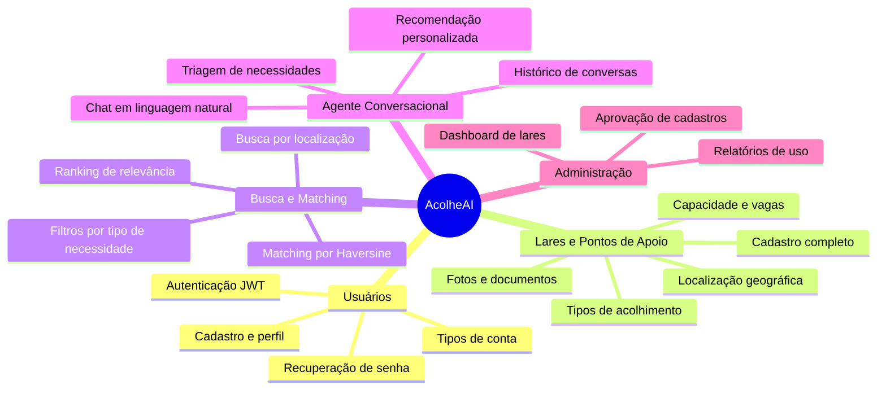

| Campo              | Valor                                    |
| ------------------ | ---------------------------------------- |
| 🔴 **Prioridade**   | Alta                                     |
| 🔄 **Sprint**       | Sprint 1 — Semana 2                      |
| 👤 **Responsável**  | Marcílio                                 |
| 📊 **Story Points** | 5 SP                                     |
| 🔗 **Dependências** | US-01                                    |
| 🚦 **Status**       | ⬜ A Fazer                               |
| 📅 **Prazo**        | 14/02/2027                               |

> ⚠️ **Observações:** Base crítica para todas as USs subsequentes. Risco: requisitos mal definidos na IA de matching podem gerar retrabalho significativo. Validar casos de borda (usuário sem localização, lar sem vagas etc).

---

### 📋 US-03

**🆔 ID:** US-03 **📌 Título:** Definição de Arquitetura e Stack Tecnológico

**📝 Descrição:** Consolidar e documentar as decisões arquiteturais do sistema: NestJS (acolhe-api), Next.js (acolhe-web), FastAPI (acolhe-ai) e Docker Compose (acolhe-infra). Definir padrões de código, convenções de branches, estratégia de CI/CD e diagrama de comunicação entre serviços.

**🎯 Objetivo:** Estabelecer a base técnica documentada garantindo coerência entre os 4 repositórios e viabilidade de desenvolvimento ao longo do semestre.

**✅ Critérios de Aceitação ("Pronto"):**

- ☐ Diagrama de arquitetura de microsserviços elaborado (acolhe-api ↔ acolhe-ai ↔ acolhe-web ↔ infra)
- ☐ ADRs (Architecture Decision Records) das escolhas tecnológicas documentados
- ☐ Padrão de branches definido (main / develop / feature/*)
- ☐ Convenção de commits padronizada (Conventional Commits)
- ☐ Pipeline CI mínima configurada no GitHub Actions

**🏗️ Comunicação entre Serviços**

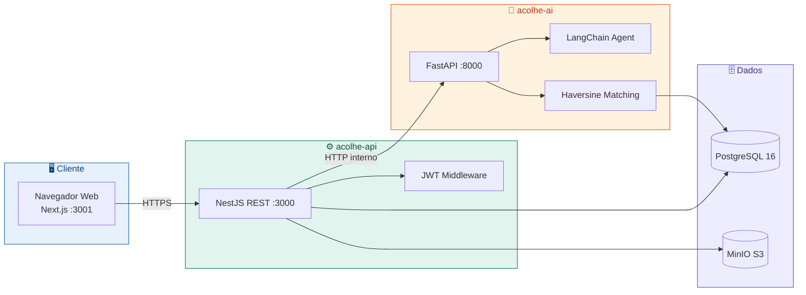

| Campo              | Valor                                    |
| ------------------ | ---------------------------------------- |
| 🔴 **Prioridade**   | Alta                                     |
| 🔄 **Sprint**       | Sprint 1 — Semanas 3 e 4                 |
| 👤 **Responsável**  | Marcílio                                 |
| 📊 **Story Points** | 5 SP                                     |
| 🔗 **Dependências** | US-02                                    |
| 🚦 **Status**       | ⬜ A Fazer                               |
| 📅 **Prazo**        | 21/02/2027                               |

> ⚠️ **Observações:** Stack já parcialmente definida nos repositórios existentes. Confirmar versões exatas, documentar e não alterar sem revisão. Risco: incompatibilidade de versões entre NestJS e Next.js pode causar problemas de CORS e integração.

---

### 📋 US-04

**🆔 ID:** US-04 **📌 Título:** Modelagem do Banco de Dados

**📝 Descrição:** Elaborar o modelo conceitual, lógico e físico do banco de dados PostgreSQL para suportar os módulos de usuários, lares, pontos de apoio, matching e histórico de conversas. Criar as migrations com TypeORM (acolhe-api) e o script de seed para dados de teste.

**🎯 Objetivo:** Criar a estrutura de persistência que suportará todos os módulos do MVP com integridade referencial, constraints adequadas e consultas geoespaciais eficientes.

**✅ Critérios de Aceitação ("Pronto"):**

- ☐ Diagrama ER elaborado e revisado com orientador
- ☐ Migrations TypeORM implementadas e versionadas no repositório
- ☐ Script de seed com dados realistas de lares e usuários para teste
- ☐ Índices geoespaciais criados (latitude/longitude) para suporte ao Haversine
- ☐ Consultas básicas de leitura testadas com dados de seed

**🗄️ Modelo Entidade-Relacionamento (Simplificado)**

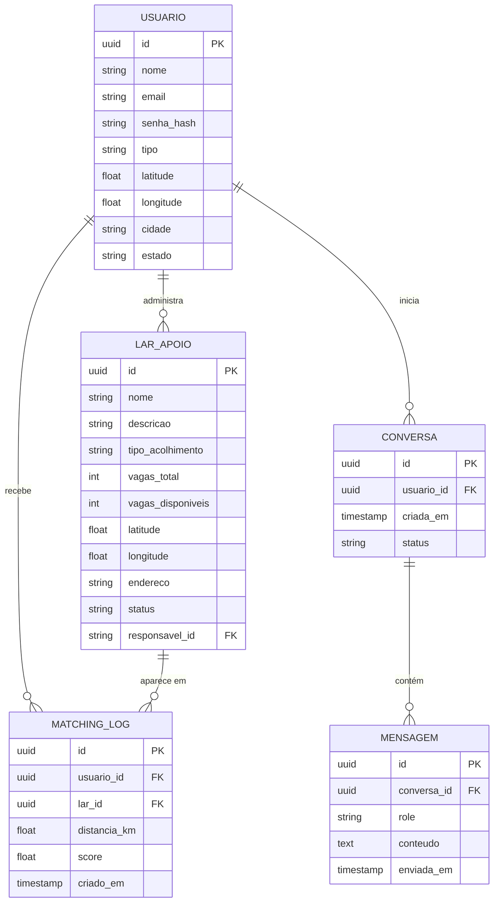

| Campo              | Valor                                    |
| ------------------ | ---------------------------------------- |
| 🔴 **Prioridade**   | Alta                                     |
| 🔄 **Sprint**       | Sprint 1 — Semanas 3 e 4                 |
| 👤 **Responsável**  | Marcílio                                 |
| 📊 **Story Points** | 8 SP                                     |
| 🔗 **Dependências** | US-02, US-03                             |
| 🚦 **Status**       | ⬜ A Fazer                               |
| 📅 **Prazo**        | 21/02/2027                               |

> ⚠️ **Observações:** Incluir extensão PostGIS ou calcular distância via aplicação (Haversine no Python). Versionar todas as migrations; nunca alterar migration já executada. Risco: mudança de requisitos pode exigir migrations de alteração de schema.

---

### 📋 US-05

**🆔 ID:** US-05 **📌 Título:** Prototipação das Interfaces (Figma)

**📝 Descrição:** Desenvolver protótipo navegável das principais telas da plataforma AcolheAI: landing page, cadastro/login, busca de lares, mapa de resultados, detalhes do lar, chat com agente e painel do administrador de lar.

**🎯 Objetivo:** Validar a usabilidade e o fluxo de navegação antes do desenvolvimento, alinhando expectativas com o orientador e reduzindo retrabalho na implementação.

**✅ Critérios de Aceitação ("Pronto"):**

- ☐ Protótipo com ao menos 10 telas navegáveis criado no Figma
- ☐ Fluxo principal validado: login → busca → resultado → chat → lar detalhado
- ☐ Validação realizada com ao menos 2 pessoas externas (potenciais usuários)
- ☐ Ajustes pós-validação documentados e aplicados no protótipo
- ☐ Link do Figma compartilhado com orientador

**🎨 Fluxo de Telas do Protótipo**

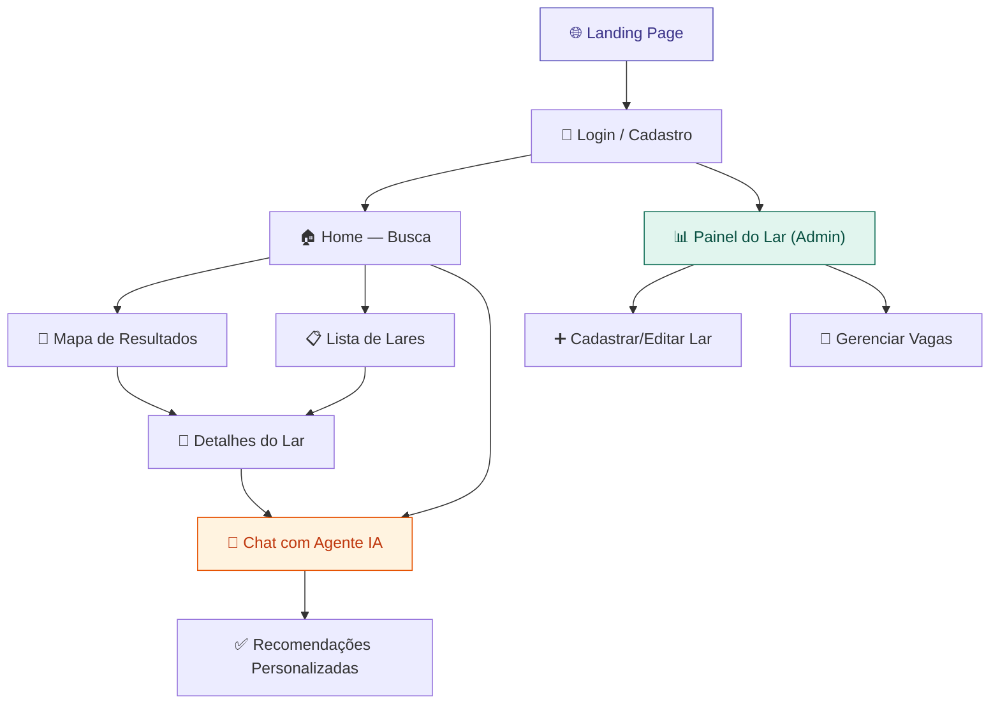

| Campo              | Valor                                    |
| ------------------ | ---------------------------------------- |
| 🟡 **Prioridade**   | Média                                    |
| 🔄 **Sprint**       | Sprint 1 — Semana 4                      |
| 👤 **Responsável**  | Marcílio                                 |
| 📊 **Story Points** | 8 SP                                     |
| 🔗 **Dependências** | US-02, US-03                             |
| 🚦 **Status**       | ⬜ A Fazer                               |
| 📅 **Prazo**        | 28/02/2027                               |

> 💡 **Observações:** Sprint Review 1 em 28/02 — protótipo deve ser apresentado ao orientador. Priorizar clareza do fluxo de busca e do chat com o agente, que são os diferenciais do MVP.

---

## 🟢 Sprint 2 — Desenvolvimento Core

> **📅 Período:** 01/03/2027 → 30/04/2027 | **📦 USs:** US-06 a US-11 | **📊 Esforço:** 60 Story Points

```
SEM.5–6          SEM.6–7              SEM.8–9             SEM.9–10         SEM.9–11        SEM.10–11
01–14/03         08–21/03             22/03–05/04         06–19/04         06–26/04        13–30/04
    │                │                    │                   │                │                │
┌───▼──────┐  ┌──────▼──────┐  ┌─────────▼──────┐  ┌────────▼──────┐  ┌─────▼────────┐  ┌────▼────────┐
│  US-06   │  │   US-07     │  │    US-08        │  │   US-09       │  │   US-10      │  │   US-11     │
│ 🐳 Infra │→ │ 🔒 Auth     │→ │ 🏠 Lares/Pontos │→ │ 📍 Matching   │→ │ 🤖 Agente IA │→ │ 🌐 UI Busca │
│  5 SP    │  │  8 SP       │  │  13 SP          │  │  13 SP        │  │  13 SP       │  │  8 SP       │
└──────────┘  └─────────────┘  └────────────────┘  └───────────────┘  └──────────────┘  └─────────────┘
                                                                                          ⬇ 30/04
                                                                                    📌 Sprint Review 2
```

---

### 📋 US-06

**🆔 ID:** US-06 **📌 Título:** Setup da Infraestrutura e DevOps

**📝 Descrição:** Configurar o ambiente completo via Docker Compose (acolhe-infra): PostgreSQL 16, MinIO, Mailhog, Nginx reverso. Ajustar variáveis de ambiente, criar script `setup.sh` funcional e configurar pipeline de CI no GitHub Actions para todos os repositórios.

**🎯 Objetivo:** Garantir que o ambiente de desenvolvimento seja reproduzível e estável para todo o ciclo de desenvolvimento.

**✅ Critérios de Aceitação ("Pronto"):**

- ☐ `docker-compose up` sobe todos os serviços sem erros
- ☐ Script `setup.sh` executa migrations e seed automaticamente
- ☐ GitHub Actions rodando lint e testes unitários em push/PR
- ☐ Variáveis de ambiente documentadas no `.env.example`
- ☐ Todos os serviços acessíveis nas portas documentadas

| Campo              | Valor                                    |
| ------------------ | ---------------------------------------- |
| 🔴 **Prioridade**   | Alta                                     |
| 🔄 **Sprint**       | Sprint 2 — Semanas 5 e 6                 |
| 👤 **Responsável**  | Marcílio                                 |
| 📊 **Story Points** | 5 SP                                     |
| 🔗 **Dependências** | US-03, US-04                             |
| 🚦 **Status**       | ⬜ A Fazer                               |
| 📅 **Prazo**        | 14/03/2027                               |

> 💡 **Observações:** Estrutura de infra já iniciada no repositório acolhe-infra. Ajustar `docker-compose.yml` existente para incluir o serviço acolhe-ai (FastAPI). Risco: conflitos de porta no ambiente local de desenvolvimento.

---

### 📋 US-07

**🆔 ID:** US-07 **📌 Título:** Módulo de Autenticação e Cadastro de Usuários (acolhe-api)

**📝 Descrição:** Implementar no NestJS os endpoints de registro, login, refresh de token e perfil do usuário. Desenvolver guard JWT, hash de senha com bcrypt, e os 3 tipos de conta: Pessoa em Busca de Apoio, Responsável por Lar e Administrador.

**🎯 Objetivo:** Disponibilizar a camada de autenticação segura que protege todos os módulos subsequentes e garante rastreabilidade de ações por usuário.

**✅ Critérios de Aceitação ("Pronto"):**

- ☐ Endpoints `POST /auth/register`, `POST /auth/login` e `GET /auth/profile` funcionais
- ☐ JWT com access token (15min) e refresh token (7 dias) implementados
- ☐ Senhas armazenadas com bcrypt (mínimo 10 rounds)
- ☐ Guard JWT aplicado nas rotas protegidas
- ☐ Testes unitários do AuthService com cobertura ≥ 80%

**🔒 Tipos de Conta e Permissões**

| Funcionalidade              | 👤 Buscador | 🏠 Resp. Lar | 👑 Admin |
| --------------------------- | ----------- | ------------ | -------- |
| Buscar lares                | ✅           | ✅            | ✅        |
| Usar agente IA              | ✅           | ✅            | ✅        |
| Cadastrar lar               | ❌           | ✅            | ✅        |
| Editar próprio lar          | ❌           | ✅            | ✅        |
| Aprovar cadastros de lares  | ❌           | ❌            | ✅        |
| Acessar relatórios gerais   | ❌           | ❌            | ✅        |
| Gerenciar usuários          | ❌           | ❌            | ✅        |

| Campo              | Valor                                    |
| ------------------ | ---------------------------------------- |
| 🔴 **Prioridade**   | Alta                                     |
| 🔄 **Sprint**       | Sprint 2 — Semanas 6 e 7                 |
| 👤 **Responsável**  | Marcílio                                 |
| 📊 **Story Points** | 8 SP                                     |
| 🔗 **Dependências** | US-04, US-06                             |
| 🚦 **Status**       | ⬜ A Fazer                               |
| 📅 **Prazo**        | 21/03/2027                               |

> 🔒 **Observações:** LGPD: dados sensíveis (localização do usuário) devem ser tratados como dados pessoais. Implementar consentimento explícito no cadastro. Nunca logar senha ou token em produção.

---

### 📋 US-08

**🆔 ID:** US-08 **📌 Título:** Módulo de Cadastro de Lares e Pontos de Apoio (acolhe-api)

**📝 Descrição:** Implementar CRUD completo de lares e pontos de apoio no NestJS: cadastro com dados completos (nome, endereço, coordenadas, tipo de acolhimento, vagas, fotos), busca por filtros, aprovação pelo administrador e upload de fotos via MinIO.

**🎯 Objetivo:** Disponibilizar o catálogo central da plataforma que permite registrar e gerenciar todos os lares e pontos de apoio disponíveis para matching.

**✅ Critérios de Aceitação ("Pronto"):**

- ☐ CRUD completo de lares com validação de campos obrigatórios
- ☐ Upload de fotos integrado ao MinIO (acolhe-infra)
- ☐ Endpoint de listagem com paginação e filtros (tipo, cidade, vagas disponíveis)
- ☐ Workflow de aprovação: Pendente → Aprovado → Ativo
- ☐ Coordenadas geográficas (lat/lng) obrigatórias para viabilizar o matching

**🏠 Fluxo de Aprovação de Lar**

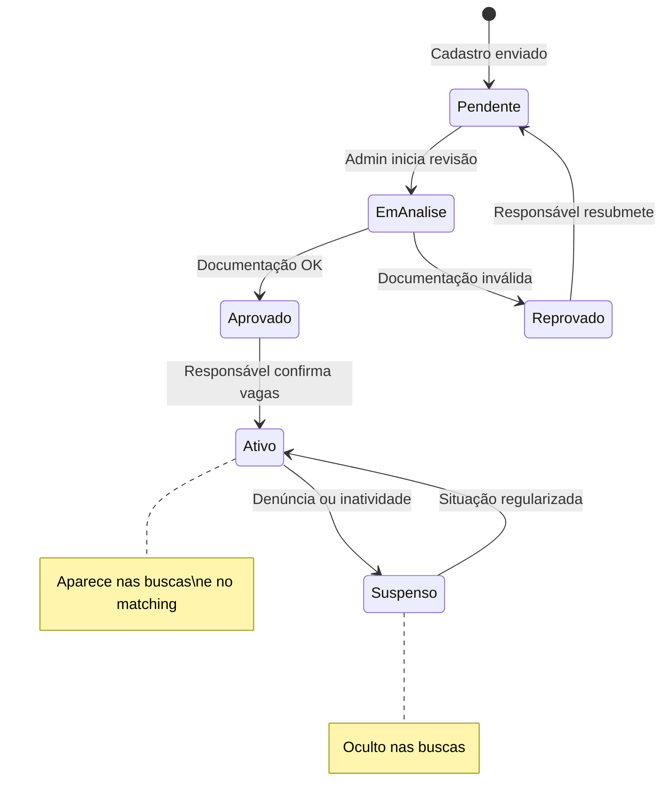

| Campo              | Valor                                    |
| ------------------ | ---------------------------------------- |
| 🔴 **Prioridade**   | Alta                                     |
| 🔄 **Sprint**       | Sprint 2 — Semanas 8 e 9                 |
| 👤 **Responsável**  | Marcílio                                 |
| 📊 **Story Points** | 13 SP                                    |
| 🔗 **Dependências** | US-04, US-07                             |
| 🚦 **Status**       | ⬜ A Fazer                               |
| 📅 **Prazo**        | 05/04/2027                               |

> 💡 **Observações:** Este é o módulo de maior esforço do Sprint 2. Garantir que geocodificação (endereço → lat/lng) seja feita no cadastro para garantir performance no matching. Considerar uso da API Nominatim (OpenStreetMap, gratuita).

---

### 📋 US-09

**🆔 ID:** US-09 **📌 Título:** Motor de Matching Geográfico com Haversine (acolhe-ai)

**📝 Descrição:** Implementar o algoritmo de matching no FastAPI (acolhe-ai) que, dado o perfil e a localização do usuário, consulta o banco de dados de lares disponíveis, calcula a distância via fórmula de Haversine e retorna os lares mais próximos com score de relevância combinado (distância + tipo de acolhimento + vagas).

**🎯 Objetivo:** Entregar o motor de recomendação geográfica que é o coração do produto AcolheAI, provendo resultados relevantes e ordenados por proximidade e aderência ao perfil.

**✅ Critérios de Aceitação ("Pronto"):**

- ☐ Endpoint `POST /match` retorna top-N lares ordenados por score
- ☐ Fórmula de Haversine implementada e testada com casos reais
- ☐ Score combina distância (peso 60%) + tipo de acolhimento (peso 30%) + vagas (peso 10%)
- ☐ Raio máximo de busca configurável (padrão: 50km)
- ☐ Testes unitários cobrindo casos extremos (usuário sem localização, sem resultados)

**📍 Lógica de Score do Matching**

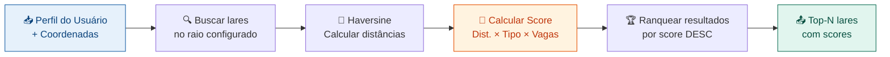

| Campo              | Valor                                    |
| ------------------ | ---------------------------------------- |
| 🔴 **Prioridade**   | Alta                                     |
| 🔄 **Sprint**       | Sprint 2 — Semanas 9 e 10                |
| 👤 **Responsável**  | Marcílio                                 |
| 📊 **Story Points** | 13 SP                                    |
| 🔗 **Dependências** | US-08                                    |
| 🚦 **Status**       | ⬜ A Fazer                               |
| 📅 **Prazo**        | 19/04/2027                               |

> 💡 **Observações:** Risco: performance em bases com muitos lares. Mitigação: índice de BTree em (latitude, longitude) no PostgreSQL + bounding box para pré-filtragem antes do Haversine. Documentar fórmula e decisões no ADR.

---

### 📋 US-10

**🆔 ID:** US-10 **📌 Título:** Agente Conversacional com LangChain + OpenAI (acolhe-ai)

**📝 Descrição:** Implementar o agente conversacional no FastAPI usando LangChain e OpenAI GPT-4o-mini. O agente deve conduzir uma triagem empática, coletar informações de necessidade do usuário (tipo de acolhimento, localização, urgência), acionar o motor de matching (US-09) e apresentar recomendações em linguagem natural.

**🎯 Objetivo:** Entregar a interface inteligente e humanizada que diferencia o AcolheAI de uma simples busca por filtros, tornando a experiência de encontrar apoio mais acessível e acolhedora.

**✅ Critérios de Aceitação ("Pronto"):**

- ☐ Endpoint `POST /chat` recebe mensagem e retorna resposta do agente
- ☐ Histórico de conversa mantido por sessão (UUID de conversa)
- ☐ Agente integra ferramenta de matching (LangChain Tool → US-09)
- ☐ Prompt do sistema define tom empático e foco no acolhimento
- ☐ Fallback implementado quando OpenAI API está indisponível

**🤖 Fluxo do Agente Conversacional**

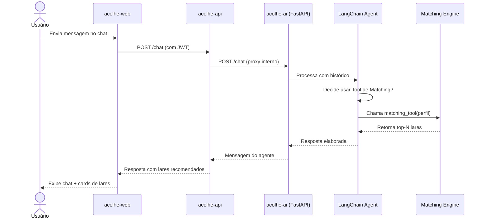

| Campo              | Valor                                    |
| ------------------ | ---------------------------------------- |
| 🔴 **Prioridade**   | Alta                                     |
| 🔄 **Sprint**       | Sprint 2 — Semanas 9, 10 e 11            |
| 👤 **Responsável**  | Marcílio                                 |
| 📊 **Story Points** | 13 SP                                    |
| 🔗 **Dependências** | US-08, US-09                             |
| 🚦 **Status**       | ⬜ A Fazer                               |
| 📅 **Prazo**        | 26/04/2027                               |

> ⚠️ **Observações:** Risco: custo da API OpenAI em caso de uso intenso durante testes. Mitigação: usar modelo gpt-4o-mini com limite de tokens e mock local para testes. Garantir que o agente nunca forneça diagnósticos médicos — apenas indicações de lares e pontos de apoio.

---

### 📋 US-11

**🆔 ID:** US-11 **📌 Título:** Interface Web — Busca e Listagem de Lares (acolhe-web)

**📝 Descrição:** Implementar as telas de busca (com filtros), listagem de resultados em cards e mapa interativo no Next.js 14. Integrar com os endpoints de busca e matching da acolhe-api. Exibir distância, tipo de acolhimento, vagas e avaliação de cada lar.

**🎯 Objetivo:** Entregar a interface principal de descoberta de lares, permitindo ao usuário encontrar opções de forma visual, intuitiva e geolocalizada.

**✅ Critérios de Aceitação ("Pronto"):**

- ☐ Tela de busca com filtros (cidade, tipo de acolhimento, vagas) funcional
- ☐ Listagem em cards com foto, nome, distância, tipo e vagas disponíveis
- ☐ Mapa interativo com marcadores dos lares (Leaflet/OpenStreetMap)
- ☐ Paginação funcional na listagem
- ☐ Interface responsiva (mobile e desktop)

| Campo              | Valor                                    |
| ------------------ | ---------------------------------------- |
| 🔴 **Prioridade**   | Alta                                     |
| 🔄 **Sprint**       | Sprint 2 — Semanas 10 e 11               |
| 👤 **Responsável**  | Marcílio                                 |
| 📊 **Story Points** | 8 SP                                     |
| 🔗 **Dependências** | US-07, US-08, US-09                      |
| 🚦 **Status**       | ⬜ A Fazer                               |
| 📅 **Prazo**        | 30/04/2027                               |

> 💡 **Observações:** Sprint Review 2 em 30/04 — o MVP deve estar demonstrável (busca + matching + tela de resultados). Priorizar usabilidade e acessibilidade (contraste, fontes legíveis, navegação por teclado).

---

## 🔵 Sprint 3 — Finalização, Testes & Entrega

> **📅 Período:** 01/05/2027 → 11/07/2027 | **📦 USs:** US-12 a US-15 | **📊 Esforço:** 34 Story Points

```
SEM.12–13         SEM.13–16               SEM.16–18         SEM.14–21
01–17/05          18/05–07/06             08–21/06          01/06–11/07
    │                  │                      │                   │
┌───▼──────────┐  ┌────▼───────────┐  ┌──────▼───────┐  ┌───────▼──────────┐
│  US-12       │  │  US-13         │  │   US-14       │  │   US-15          │
│ 💬 UI Chat   │→ │ 🧪 Testes      │→ │ 🚀 Deploy    │→ │ 📚 Documentação  │
│  e Detalhes  │  │  e Correções   │  │  Produção    │  │  e TCC Final     │
│  8 SP        │  │  8 SP          │  │  5 SP        │  │  13 SP           │
└──────────────┘  └────────────────┘  └──────────────┘  └──────────────────┘
                  ⬇ 07/06                                ⬇ 11/07
             Sistema completo                      📌 Entrega Final TCC
```

---

### 📋 US-12

**🆔 ID:** US-12 **📌 Título:** Interface Web — Chat com Agente e Detalhes do Lar (acolhe-web)

**📝 Descrição:** Implementar a interface de chat em tempo real com o agente conversacional e a tela de detalhes de cada lar (fotos, informações completas, mapa, contato e botão de solicitação de acolhimento). Integrar com os endpoints de chat (US-10) e detalhes de lar (US-08).

**🎯 Objetivo:** Entregar as telas de maior valor percebido do produto — o chat com IA e os detalhes do lar — completando o fluxo principal do MVP.

**✅ Critérios de Aceitação ("Pronto"):**

- ☐ Interface de chat com input de mensagem e histórico de conversa exibido
- ☐ Cards de lares recomendados pelo agente renderizados dentro do chat
- ☐ Tela de detalhes do lar com galeria de fotos, mapa e informações completas
- ☐ Streaming de resposta do agente implementado (UX de digitação)
- ☐ Interface responsiva e acessível

| Campo              | Valor                                    |
| ------------------ | ---------------------------------------- |
| 🟡 **Prioridade**   | Média                                    |
| 🔄 **Sprint**       | Sprint 3 — Semanas 12 e 13               |
| 👤 **Responsável**  | Marcílio                                 |
| 📊 **Story Points** | 8 SP                                     |
| 🔗 **Dependências** | US-10, US-11                             |
| 🚦 **Status**       | ⬜ A Fazer                               |
| 📅 **Prazo**        | 17/05/2027                               |

> 💡 **Observações:** Implementar streaming via Server-Sent Events (SSE) ou WebSocket para efeito de "digitação" do agente — melhora significativamente a percepção de qualidade da IA.

---

### 📋 US-13

**🆔 ID:** US-13 **📌 Título:** Testes, Correções e Ajustes Finais

**📝 Descrição:** Executar testes de todos os módulos da plataforma com foco no fluxo principal (cadastro → busca → chat → lar). Registrar bugs, priorizar por severidade, corrigir os críticos e realizar ajustes de usabilidade. Executar testes de carga básicos nos endpoints de matching e chat.

**🎯 Objetivo:** Garantir que a plataforma esteja funcional, estável e sem erros críticos para a entrega final do TCC e demonstração ao orientador.

**✅ Critérios de Aceitação ("Pronto"):**

- ☐ Fluxo principal E2E testado sem erros críticos
- ☐ Bugs críticos e bloqueantes corrigidos
- ☐ Bugs de média severidade documentados no GitHub Issues
- ☐ Testes de carga básicos no endpoint `/match` (mínimo 50 req/s sem degradação)
- ☐ Revisão de acessibilidade básica (contraste, labels em formulários, alt em imagens)

**🧪 Matriz de Cobertura de Testes**

| Módulo                    | 🔍 Funcional | ✅ Validações | 🔄 Fluxo E2E | ⚡ Carga |
| ------------------------- | ------------ | ------------ | ----------- | ------- |
| 🔐 Autenticação            | ☐            | ☐            | ☐           | —       |
| 🏠 Cadastro de Lares       | ☐            | ☐            | ☐           | —       |
| 📍 Motor de Matching       | ☐            | ☐            | ☐           | ☐       |
| 🤖 Agente Conversacional   | ☐            | ☐            | ☐           | ☐       |
| 🌐 Busca e Listagem (Web)  | ☐            | ☐            | ☐           | —       |
| 💬 Chat com Agente (Web)   | ☐            | ☐            | ☐           | —       |
| 🏡 Detalhes do Lar (Web)   | ☐            | ☐            | ☐           | —       |
| 📊 Painel do Responsável   | ☐            | ☐            | ☐           | —       |

| Campo              | Valor                                    |
| ------------------ | ---------------------------------------- |
| 🔴 **Prioridade**   | Alta                                     |
| 🔄 **Sprint**       | Sprint 3 — Semanas 13 a 16               |
| 👤 **Responsável**  | Marcílio                                 |
| 📊 **Story Points** | 8 SP                                     |
| 🔗 **Dependências** | US-11, US-12                             |
| 🚦 **Status**       | ⬜ A Fazer                               |
| 📅 **Prazo**        | 07/06/2027                               |

> ⚠️ **Observações:** Risco: bugs críticos descobertos nesta fase podem comprometer o prazo. Mitigação: testes incrementais desde a Sprint 2, a partir da US-08. Iniciar testes do agente com inputs adversariais (perguntas fora do escopo).

---

### 📋 US-14

**🆔 ID:** US-14 **📌 Título:** Deploy em Produção e Configuração Final de Infraestrutura

**📝 Descrição:** Realizar o deploy da plataforma completa em ambiente de produção (VPS ou serviço cloud), configurar Nginx como reverse proxy, certificado SSL (Let's Encrypt), variáveis de ambiente de produção, backups do PostgreSQL e monitoramento básico (uptime).

**🎯 Objetivo:** Disponibilizar o AcolheAI em URL pública para demonstração na defesa do TCC e para acesso por avaliadores externos.

**✅ Critérios de Aceitação ("Pronto"):**

- ☐ Plataforma acessível via HTTPS em URL pública
- ☐ Certificado SSL válido configurado (Let's Encrypt)
- ☐ Todos os serviços rodando em produção via Docker Compose
- ☐ Variáveis de ambiente de produção configuradas com segurança (sem hardcode)
- ☐ Backup automático do PostgreSQL configurado

| Campo              | Valor                                    |
| ------------------ | ---------------------------------------- |
| 🟢 **Prioridade**   | Baixa                                    |
| 🔄 **Sprint**       | Sprint 3 — Semanas 16 a 18               |
| 👤 **Responsável**  | Marcílio                                 |
| 📊 **Story Points** | 5 SP                                     |
| 🔗 **Dependências** | US-13                                    |
| 🚦 **Status**       | ⬜ A Fazer                               |
| 📅 **Prazo**        | 21/06/2027                               |

> 💡 **Observações:** Risco: custo de infra cloud. Mitigação: usar planos gratuitos (Railway, Render, Fly.io) ou VPS de baixo custo. Se deploy completo inviável, garantir ao menos um ambiente de demo funcional com dados de seed.

---

### 📋 US-15

**🆔 ID:** US-15 **📌 Título:** Documentação Técnica e TCC Final

**📝 Descrição:** Elaborar a documentação técnica completa do sistema (arquitetura, banco de dados, APIs via Swagger, guia de instalação) e redigir o documento do TCC conforme normas da pós-graduação. Preparar a apresentação final (slides + demo ao vivo).

**🎯 Objetivo:** Entregar o projeto completo com toda a documentação necessária para avaliação acadêmica, uso por terceiros e manutenção futura.

**✅ Critérios de Aceitação ("Pronto"):**

- ☐ Documento do TCC redigido conforme normas da instituição
- ☐ Documentação técnica: diagrama de arquitetura, ER, APIs Swagger documentadas
- ☐ README de cada repositório atualizado com instruções de instalação e uso
- ☐ Apresentação de slides preparada (mín. 15 slides) com capturas de tela reais
- ☐ Vídeo de demo gravado (mín. 3 min) mostrando fluxo principal

**📚 Estrutura de Entregáveis da Documentação**

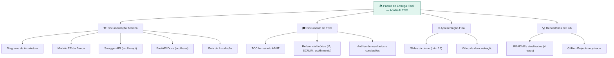

| Campo              | Valor                                    |
| ------------------ | ---------------------------------------- |
| 🟢 **Prioridade**   | Baixa                                    |
| 🔄 **Sprint**       | Sprint 3 — Semanas 14 a 21               |
| 👤 **Responsável**  | Marcílio                                 |
| 📊 **Story Points** | 13 SP                                    |
| 🔗 **Dependências** | US-13, US-14                             |
| 🚦 **Status**       | ⬜ A Fazer                               |
| 📅 **Prazo**        | 11/07/2027                               |

> 💡 **Observações:** Iniciar a redação do TCC em paralelo com a Sprint 2 para não sobrecarregar a Sprint 3. Documentar decisões arquiteturais à medida que são tomadas — facilita a escrita do referencial teórico e da metodologia.

---

## ⚠️ Mapa de Riscos do Projeto

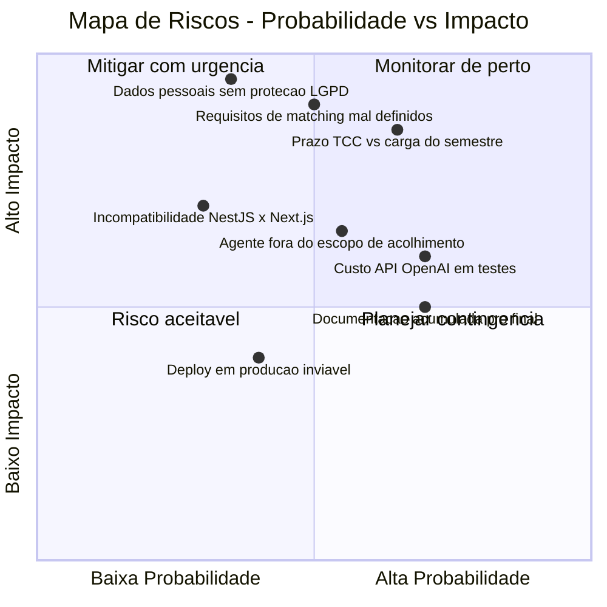

| ⚠️ Risco                                                    | 🔗 US   | 🔴 Severidade | 🛡️ Estratégia de Mitigação                                                          |
| ----------------------------------------------------------- | ------ | ------------ | ----------------------------------------------------------------------------------- |
| Custo da API OpenAI em ambiente de testes                   | US-10  | 🟡 Média      | Usar mock local para testes; gpt-4o-mini em dev; budget alert na conta OpenAI       |
| Requisitos de matching mal definidos → retrabalho           | US-02  | 🔴 Alta       | Validar critérios de score com orientador antes de implementar US-09                |
| Carga do semestre comprime o tempo de desenvolvimento       | Todas  | 🔴 Alta       | Priorizar USs do MVP; US-14 e US-15 podem ser reduzidas sem comprometer a nota      |
| Dados pessoais de usuários vulneráveis sem proteção LGPD    | US-07  | 🔴 Alta       | Implementar consentimento explícito, minimização de dados e criptografia em repouso |
| Agente IA fornece orientações fora do escopo (ex: médicas)  | US-10  | 🔴 Alta       | System prompt com restrições explícitas + fallback com disclaimer legal             |
| Documentação do TCC acumulada para o final                  | US-15  | 🟡 Média      | Documentar em paralelo com o desenvolvimento a partir da Sprint 2                   |
| Deploy em produção inviável por custo/complexidade          | US-14  | 🟢 Baixa      | Aceitar ambiente de demo local com seed de dados para a apresentação                |

---

## 🔄 Cerimônias SCRUM Previstas

### Calendário de Cerimônias

| 📅 Data        | 🔄 Cerimônia                     | 📋 Objetivo                                                    |
| ------------- | -------------------------------- | -------------------------------------------------------------- |
| 01/02/2027    | Sprint Planning 1                | Detalhar USs do Sprint 1, estimar SPs, definir Definition of Done |
| Semanal       | Sprint Review pessoal (solo)     | Auto-revisão do progresso, atualização do GitHub Projects       |
| 28/02/2027    | Sprint Review 1 + Retrospectiva 1 | Apresentar protótipo ao orientador; revisar o que funcionou    |
| 01/03/2027    | Sprint Planning 2                | Detalhar USs do Sprint 2, reestimar se necessário               |
| 30/04/2027    | Sprint Review 2 + Retrospectiva 2 | Demonstrar MVP funcional ao orientador                         |
| 01/05/2027    | Sprint Planning 3                | Detalhar USs do Sprint 3, ajustar escopo conforme pendências   |
| 11/07/2027    | Sprint Review 3 + Entrega Final  | Defesa do TCC — apresentação completa da plataforma            |

### Definition of Done (DoD) Geral

Para que qualquer User Story seja considerada **"Pronta"**, ela deve atender a:

- ☐ Todos os critérios de aceitação da US cumpridos
- ☐ Código commitado no repositório correspondente (branch `develop` ou `main`)
- ☐ Testes unitários implementados (cobertura ≥ 70% para módulos backend)
- ☐ Código revisado (auto-revisão com checklist de boas práticas)
- ☐ Documentação técnica atualizada (README ou comentários de código)
- ☐ Funcionalidade demonstrável no ambiente de desenvolvimento local

---

## 📈 Estimativa Total de Esforço

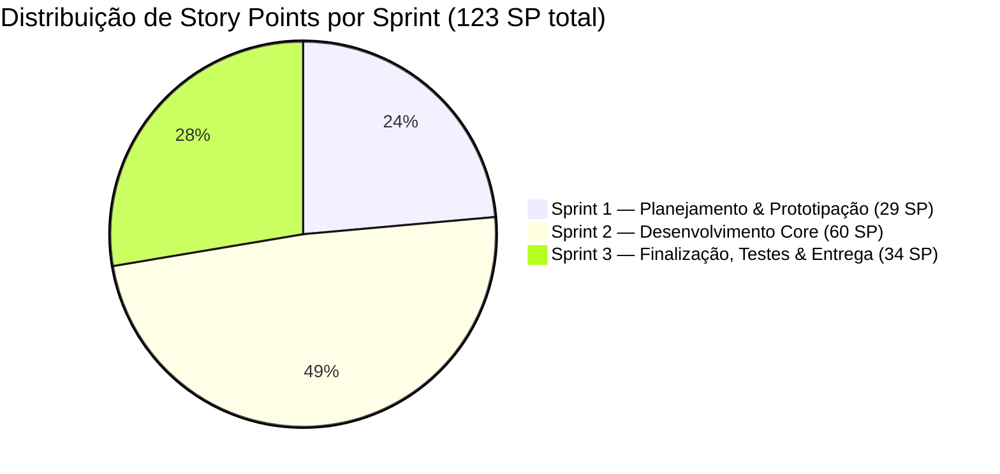

| 🔄 Sprint                                   | 📦 User Stories | 📊 Story Points | 📅 Período          |
| ------------------------------------------ | --------------- | --------------- | ------------------ |
| 🟣 Sprint 1 — Planejamento & Prototipação   | US-01 a US-05   | 29 SP           | 01/02 → 28/02/2027 |
| 🟢 Sprint 2 — Desenvolvimento Core          | US-06 a US-11   | 60 SP           | 01/03 → 30/04/2027 |
| 🔵 Sprint 3 — Finalização, Testes & Entrega | US-12 a US-15   | 34 SP           | 01/05 → 11/07/2027 |
| **🏁 Total**                                | **15 USs**      | **123 SP**      | **01/02 → 11/07**  |

---

## 🔄 Fluxo SCRUM do Projeto

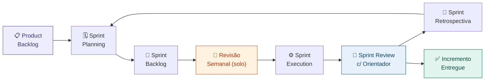

---

## 🔗 Repositórios do Projeto

| Repositório                                                             | Descrição                             | Stack                          | Porta |
| ----------------------------------------------------------------------- | ------------------------------------- | ------------------------------ | ----- |
| [acolhe-infra](https://github.com/omarcilioaguiar/acolhe-infra)         | Docker Compose, Nginx, scripts        | Docker, Nginx, Shell           | —     |
| [acolhe-api](https://github.com/omarcilioaguiar/acolhe-api)             | Backend REST API                      | NestJS, TypeORM, PostgreSQL 16 | 3000  |
| [acolhe-ai](https://github.com/omarcilioaguiar/acolhe-ai)               | Motor de matching e agente IA         | FastAPI, LangChain, OpenAI     | 8000  |
| [acolhe-web](https://github.com/omarcilioaguiar/acolhe-web)             | Interface web                         | Next.js 14, TypeScript, Tailwind | 3001  |

---

*📄 Cronograma elaborado para o TCC do Curso de Pós-Graduação — Metodologia SCRUM*
*🔄 Método Ágil: SCRUM | 📅 Semestre: 2027.1 (Fev–Jul) | 👤 Discente: Marcílio*
*🔗 Referência de modelo: [GIPAR-IBLS](https://github.com/leoreboucas/desafio3-GIPAR-IBLS)*
